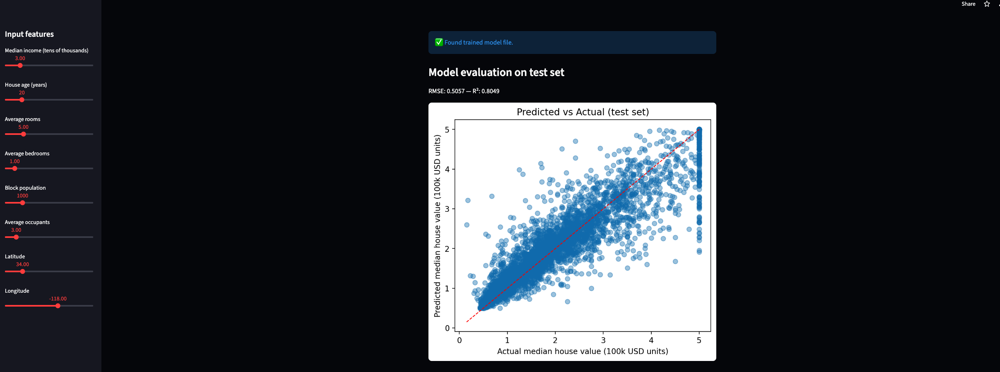

# 🏠 House Price Predictor

Live demo: [House Price Predictor (Streamlit)](https://house-price-predictor-huwskzwh7x5v4ppnmjgfdm.streamlit.app/)

> Predicts median house values (California housing dataset) with an interactive web app built using Python, scikit-learn and Streamlit.

---

## Features
- End-to-end ML pipeline: data → train → evaluate → serve
- Interactive Streamlit UI with sliders for 8 features:
  `MedInc, HouseAge, AveRooms, AveBedrms, Population, AveOccup, Latitude, Longitude`
- Model selection (Linear Regression vs Random Forest) and saved model serialization (`joblib`)
- Feature importance visualization to explain model decisions
- Predicted vs Actual evaluation chart (RMSE & R²)
- Lightweight fallback training on Streamlit Cloud for easy deployment

---

## Live demo
Try it:  
[https://house-price-predictor-huwskzwh7x5v4ppnmjgfdm.streamlit.app/](https://house-price-predictor-huwskzwh7x5v4ppnmjgfdm.streamlit.app/)

---

## Tech stack
- Python 3.8+
- scikit-learn
- pandas, numpy, matplotlib
- Streamlit (UI)
- joblib (model serialization)

---

## Files in this repo
- `app.py` — Streamlit app (UI + model loading/training + evaluation + explainability)
- `train_model.py` — training script (creates `house_price_model.joblib`, `eval.csv`)
- `california_housing.csv` — dataset (small sample or full CSV)
- `eval.csv` — saved test-set predictions (y_true / y_pred)
- `requirements.txt` — Python dependencies

---

